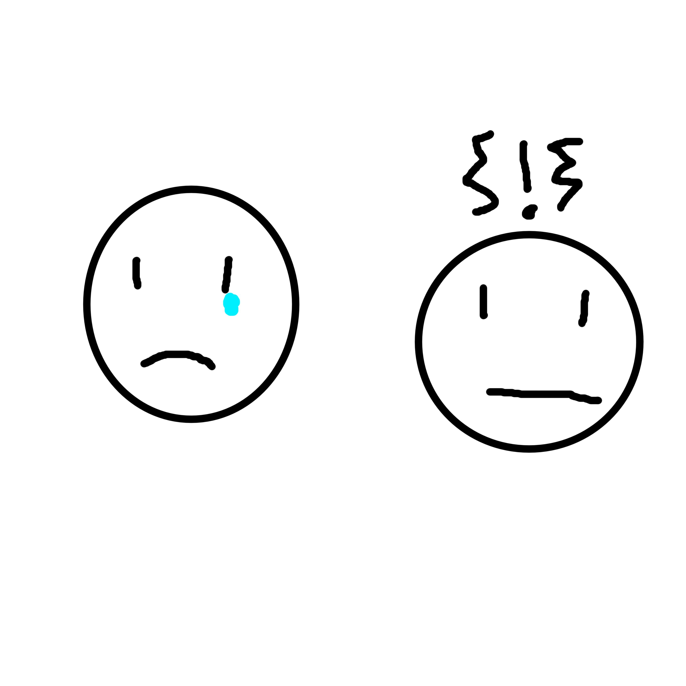

# Geschiedenis
## China (1840 - 1911)
**Modern imperialisme**
- Koloniseren van Afrika
- Uitbreiden van politieke macht in aziatische koloniën

**Waarom begon dit in deze tijd**
- De industriele revolutie
- - Zorgde voor betere wapebs
- - Zorgde voor beter transport (Stoomboot, trein)

**Oorzaken van het modern imperialisme(toets)**

politiek
- Europese staten wilden er machtiger uitzien door het hebben van een groot rijk
- Nationalisme
- - Groot rijk = trotse burgers

Economisch
- Grondstoffen
- - De industriele revolutie had veel grondstoffen nodig die alleen gevonden konden worden in toekomstige koloniën
- Afzetmarkt
- - Europese producten werden verkocht in veroverde landen (bijv. india)

Cultureel
- De rest van de wereld moet beschaving worden bijgebracht.

# Economie
## Hoofdstuk 8: Onderhandelen
**Verzonken kosten**
- Investeringen die je niet meer terug kan verdienen

**Marktvormen en Marktmacht**

Volledige mededinging
 -  geen macht bij de consument
 -  geen macht bij de producent
 - - voorbeeld, de valuta markt (dollars kopen)

 Monopolie
- Geen macht bij de consument
- Veel macht bij de producent
- - de NS
- - prijzen worden alleen in toom gehouden door de toegankelijkheid van alternatieven zoals de fiets

Oligopolie
- geen macht bij de consument
- veel maar niet alle macht bij de producent
- - de producenten kunnen de prijzen aanpassen maar houden rekening met elkaar omdat er niet heel veel zijn

Monopolistiche concurentie
 - geen macht bij de consumenten
 - alleen macht bij de producent als ze een unieke eigenschap of merknaam (gucci) naar de markt kunnen brengen

**Maximale winst = MO = MK geld alleen voor volledige concurentie**
- mo = marginale opbrengst
- mk = marginale kosten

# Engels
**Emenata**
- drawings showing action
-  - tears
   - anger squiggle

